<p align="center">
  
</p>

# web-api-docs

A [Claude Code](https://claude.com/claude-code) skill that fetches MDN
web-platform documentation straight from the
[`mdn/content`](https://github.com/mdn/content) GitHub repo. No
browser, no scraping, no API key.

When a model needs the canonical reference for a JavaScript built-in, a
Web API, a CSS property or selector, an HTTP header, an HTML element,
or a glossary term, this skill turns the question into a single HTTP
fetch of the raw Markdown and prints a clean text rendering with the
MDN URL at the top.

## How it works

- A **shipped slug → repo-path index** (`index/web-docs.tsv`, ~12.6k
  entries) maps every in-scope MDN slug to its repo path with zero
  network calls.
- A **shipped redirect map** (`index/redirects.tsv`, ~9k entries)
  follows moved pages, so old slugs like `Web/CSS/:hover` still
  resolve.
- The slug → folder encoder is a byte-for-byte mirror of
  [yari's `slugToFolder`](https://github.com/mdn/yari/blob/main/libs/slug-utils/index.js)
  plus the npm `sanitize-filename` rules — no drift, no silent 404s.
- Fetched docs are cached on disk with `ETag` / `Last-Modified`
  conditional GETs, so repeat lookups are effectively free.
- Light **KumaScript cleanup** turns `{{Macro(arg)}}` tokens into
  inline badges, blockquote banners, or `> _(... omitted — see MDN.)_`
  placeholders. The original tokens are available with `--raw`.

Scope: `files/en-us/web/**` and `files/en-us/glossary/**` — covers HTML,
CSS, JavaScript, Web APIs, HTTP, SVG, MathML, WebAssembly,
Accessibility, Web Extensions, and the Glossary. Python stdlib only;
no third-party dependencies.

## Install

### Into your local Claude Code

Clone the repo and run the installer. By default it **copies** the
skill into `~/.claude/skills/web-api-docs/`.

```bash
git clone <repo-url> web-api-docs
cd web-api-docs
./install.sh                  # copy into ~/.claude/skills/
./install.sh --symlink        # symlink instead (edits track the checkout)
```

Other destinations are mutually exclusive:

```bash
./install.sh --project /path/to/proj    # → proj/.claude/skills/web-api-docs
./install.sh --home    /path/to/home    # → home/.claude/skills/web-api-docs
./install.sh --user    alice            # look up alice's home automatically
```

Useful flags: `--force` to overwrite an existing install, `--dry-run`
to preview, `--uninstall` to remove, `--name OTHER` to install under a
different folder name.

Windows-native users: run `install.ps1` instead. Symlink mode needs
Developer Mode or an elevated shell; copy mode works as-is.

### Into Claude Code on the web

Build a zip and upload it via the web UI's skill upload:

```bash
./package-skill.sh                       # writes ./web-api-docs.zip
./package-skill.sh -o /tmp/out.zip       # custom output path
./package-skill.sh --dry-run             # list what would be packed
```

The archive contains `web-api-docs/` at its root with the shipped
index, scripts, and `SKILL.md` — ready to upload. `.cache/`, `.git/`,
`.claude/`, and `__pycache__/` are excluded. Pure stdlib (works on
Windows without `zip` / 7-zip).

## Usage

Once installed, Claude Code discovers the skill via `SKILL.md`. Inside
a session, the skill exposes these commands:

```bash
# Read one doc — accepts a slug, a full MDN URL, or a repo path
python3 scripts/mdn.py get "Web/CSS/:hover"
python3 scripts/mdn.py get "https://developer.mozilla.org/en-US/docs/Web/API/fetch"
python3 scripts/mdn.py get "Glossary/CORS" --json
python3 scripts/mdn.py get "Web/JavaScript/Reference/Global_Objects/Array/map" --raw

# Fuzzy-find a slug in the shipped index
python3 scripts/mdn.py search "intersectionobserver"

# List immediate children of a slug
python3 scripts/mdn.py browse "Web/API/Fetch_API"
```

To regenerate the shipped index (rarely needed — the encoder is
stable, and 7-day cache TTLs absorb minor MDN churn):

```bash
export GH_TOKEN="$(gh auth token)"     # avoid the 60 req/hr unauth limit
python3 scripts/mdn.py refresh
```

See [`reference.md`](reference.md) for the slug → folder encoding
rules, the full macro substitution table, cache layout, and
environment variables.

## Requirements

- Python 3.8+. Stdlib only — no `pip install` step.
- For `refresh`: network access and a GitHub token
  (`GITHUB_TOKEN` / `GH_TOKEN`); `gh auth token` works.
- For symlink installs on Windows: Developer Mode or an admin shell.

## What this is not

- **Not a renderer for browser-compat tables or live samples.** Those
  macros become `> _(... omitted — see MDN.)_` placeholders; standalone
  fenced code blocks (e.g. ``` ```css interactive-example ```) remain
  intact. Follow the MDN URL in the header for the interactive bits.
- **Not full-text search.** The index is slug-only — concepts not named
  in the slug (e.g. "flexbox" → `css_flexible_box_layout`) will miss.
  Fall back to `browse` from a known parent, or paste a known MDN URL
  into `get`.
- **Not server-runtime docs.** MDN covers the web platform; for Node /
  Deno / Bun, use those projects' own docs.

## License & attribution

This skill is tooling. The MDN content fetched at runtime is © Mozilla
Contributors and licensed under
[CC BY-SA 2.5](https://developer.mozilla.org/en-US/docs/MDN/About#copyrights_and_licenses).
